-Game Explorer-
Aplicación móvil desarrollada con React Native y Expo que permite explorar videojuegos,, buscar títulos, consultar información y guardar/eliminar juegos como favoritos.
El proyecto integra autenticación de usuarios, consumo de una API externa y almacenamiento de favoritos y sesión mediante Supabase.

Funcionalidades: 

•Registro e inicio de sesión de usuarios
•Gestión de sesión y cierre de sesión
•Exploración de videojuegos por categorías
•Búsqueda de videojuegos por nombre
•Visualización de información detallada de cada juego 
•Agregar juegos a favoritos
•Eliminar juegos de favoritos
•Persistencia de sesión
•Navegación mediante tabs
•Actualización de favoritos al enfocar la pantalla

Tecnologías:

•React Native
•Expo
•TypeScript
•Expo Router
•Supabase
•RAWG Video Games Database API

Capturas de pantalla:

• Login
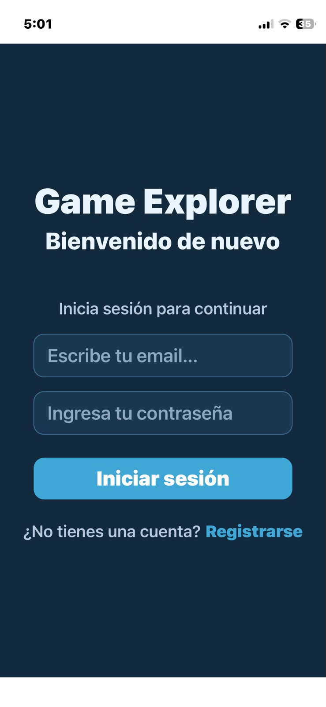

• Register
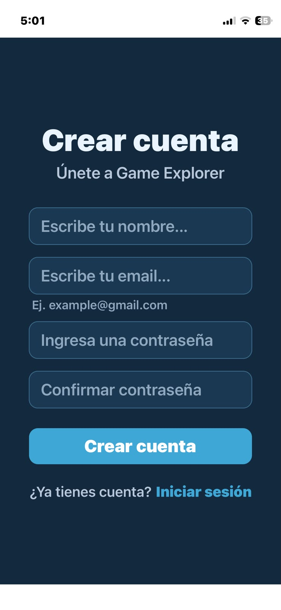

• Home
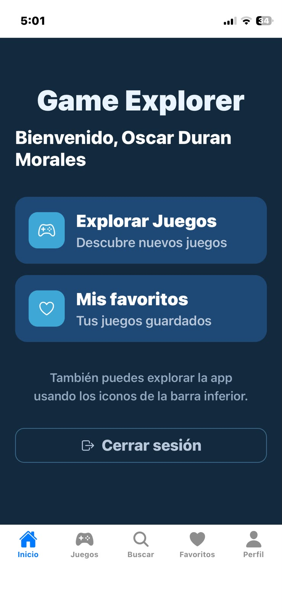

• Games
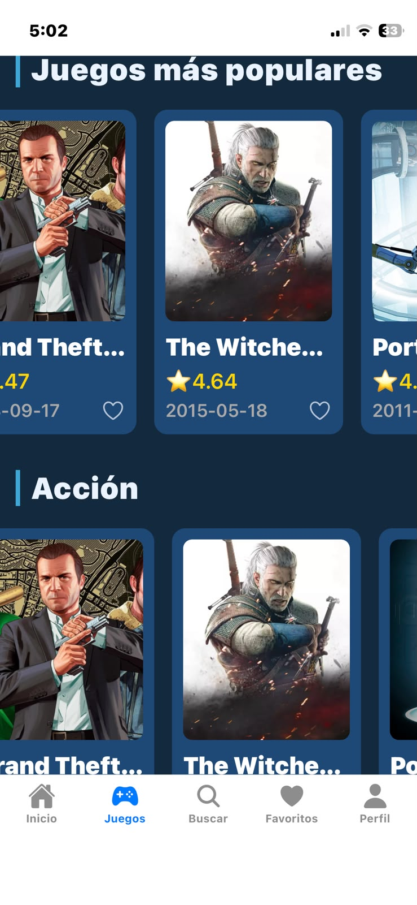

• Games — Categorías
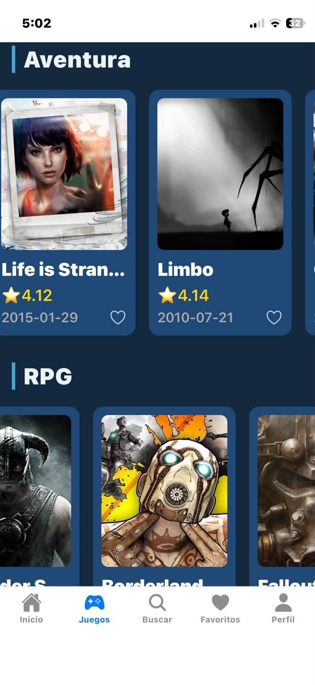

• Details
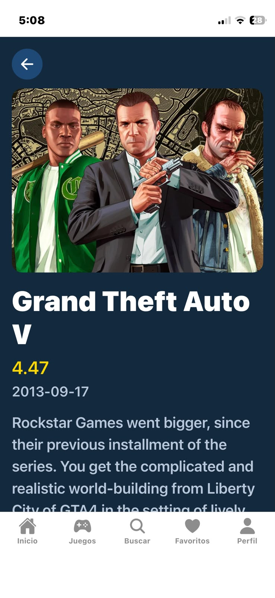

• Details — Información adicional
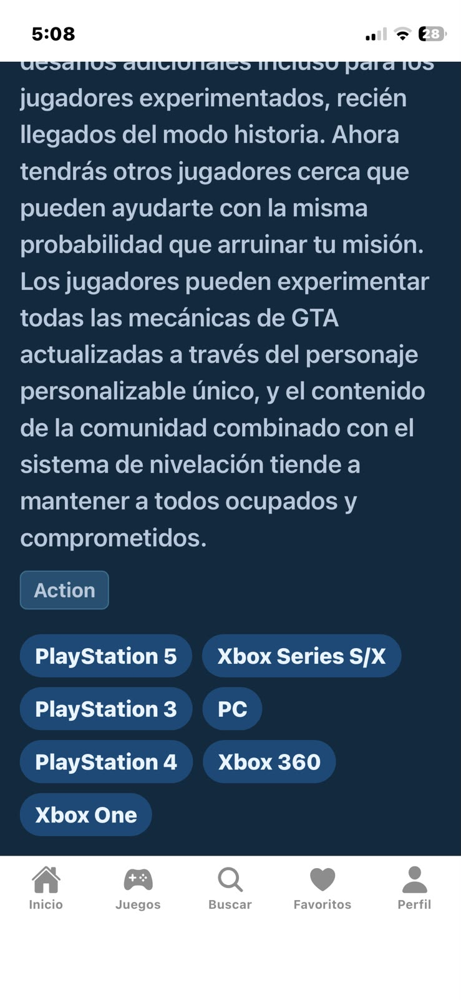

• Search
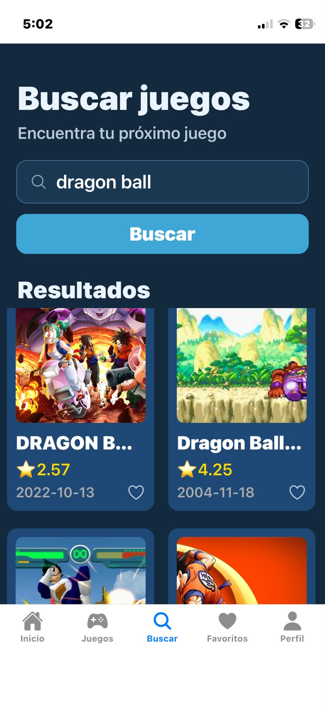

• Favorites
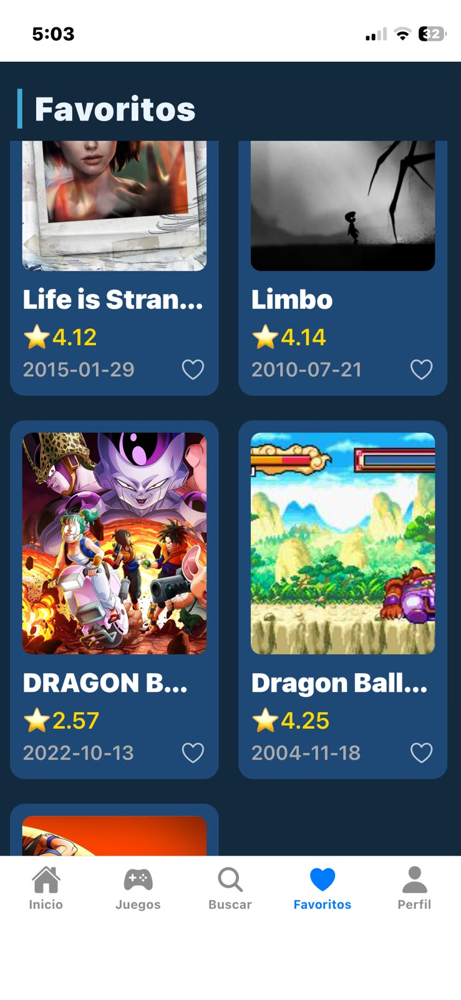

• Profile
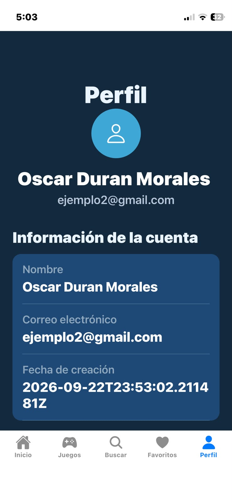

Estructura del proyecto:

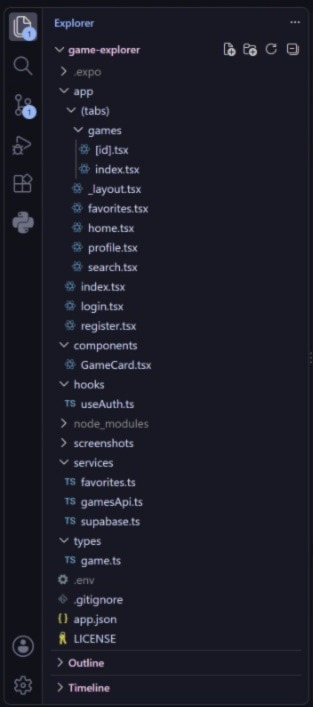

Configuración:

El proyecto utiliza variables de entorno para configurar las credenciales necesarias.
Crea un archivo .env en la raíz del proyecto (no está en el repositorio, está incluído en .gitignore)
EXPO_PUBLIC_GAME_API_KEY=tu_api_key 
EXPO_PUBLIC_SUPABASE_URL=tu_supabase_url 
EXPO_PUBLIC_SUPABASE_PUBLISHABLE_KEY=tu_supabase_publishable_ke

Instalación:

1. Clona el repositorio: 
git clone https://github.com/oscarduran-dev/game-explorer.git

2. Entra al proyecto
cd game-explorer

3. Instala las dependecias
npm install

4. Configura las variables de entorno en .env

5. Inicia Expo:
npx expo start

Yo utilicé Expo Go para visualizar la aplicación en mi celular

Objetivo del proyecto:
Este proyecto fue desarrollado como práctica para consolidar conocimientos de React Native, integrando diferentes tecnologías y conceptos necesarios para construír una aplicación móvil funcional.

